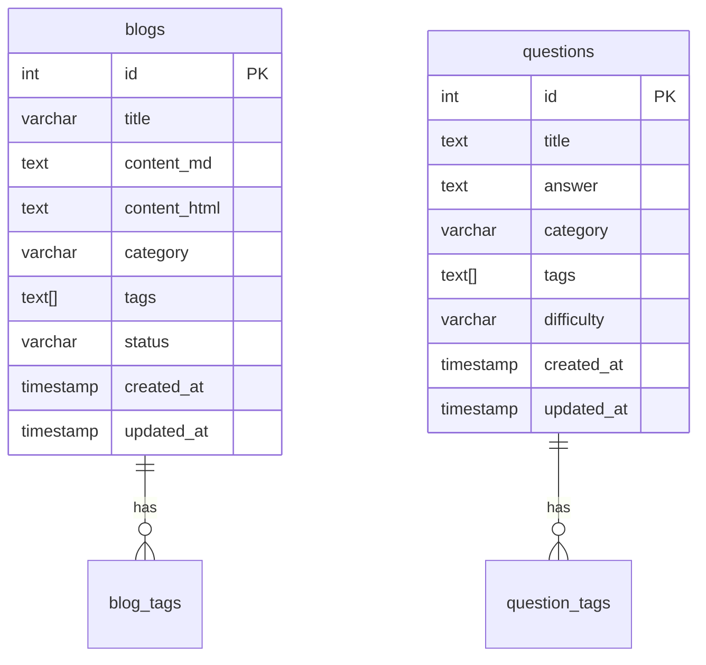

# DevHub 数据库设计

## ER 图

## 表结构说明
- blogs：博客表
- questions：题库表

## 字段说明
- id：主键，自增
- title：标题/题目
- content_md：Markdown 内容
- content_html：HTML 内容
- category：分类
- tags：标签数组
- status：状态（draft/published）
- difficulty：难度（题库）
- created_at/updated_at：时间戳

## 迁移说明
- 使用 GORM 自动迁移
- 可用 golang-migrate 进行版本化管理（可选） 