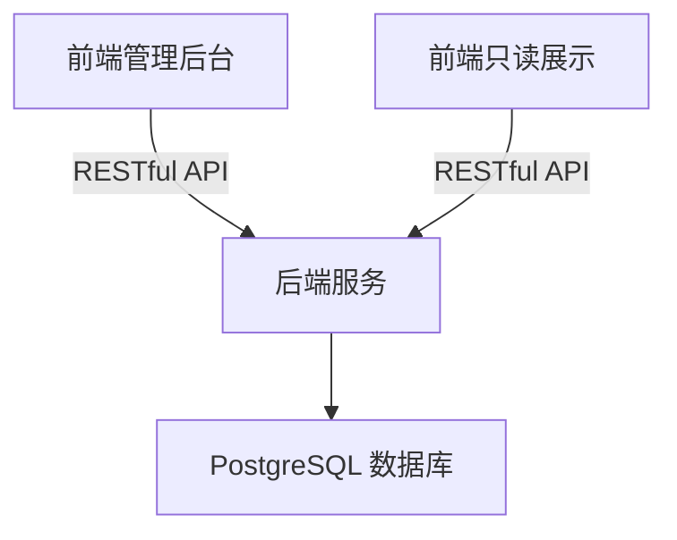

# DevHub 项目总览

## 背景与目标
DevHub 致力于打造一个集技术博客与题库于一体的统一平台，提升团队知识沉淀与技术成长效率。

## 技术架构
- 前端：Vue3 + Vite + Element Plus
- 后端：Go + Gin + GORM
- 数据库：PostgreSQL

## 功能模块
- 博客系统
- 题库系统
- 管理后台
- 只读展示端

## 总体架构图


## 目录结构
```
dev_hub/
├── backend/              # Go + Gin 后端服务
├── admin-frontend/       # Vue3 管理后台
├── web-frontend/         # Vue3 只读展示端
├── docs/                 # 项目文档
├── scripts/              # 根目录通用脚本
├── docker-compose.yml    # 一键部署（可选）
├── .env.example          # 环境变量模板
└── readme.md             # 项目总览
``` 